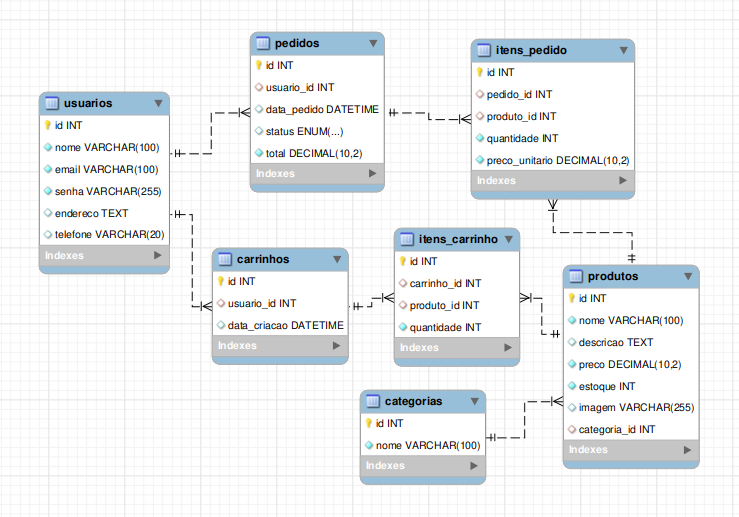

# Projeto E-Commerce - ByCrib

Desenvolvimento de uma loja online para a ByCrib, uma empresa especializada em streetwear e sneakers, oferecendo produtos de diversas marcas nacionais e internacionais. O projeto visa expandir a presença digital da marca, proporcionando uma experiência de compra mais prática e acessível para seus clientes.

**Professor**: [Marco André Mendes](https://github.com/marcoandre)

**Equipe**:
- [Caetano P. Freitas](https://github.com/caetanopf)
- [João G. L. Martins](https://github.com/joaoguilherme222)
- [Lucas B. Amaya](https://github.com/bokorni)
- [Pedro H. Silva](https://github.com/pedroifc)

**Links do projeto**:
- [Documentação (esse documento)](https://github.com/ByCrib-TEAM/ByCrib_Front?tab=readme-ov-file#bycrib_front)
- **Backend**: [Repositório](https://github.com/ByCrib-TEAM/ByCrib_Back.git) e [Publicação](#)
- **Frontend**: [Repositório](https://github.com/ByCrib-TEAM/ByCrib_Front.git) e [Publicação](#)

## 1. Desenvolvimento do Projeto

### 1.1 Loja Online para a ByCrib

A ByCrib é uma loja física especializada em streetwear e sneakers, localizada em Joinville, SC. Atualmente, as vendas ocorrem apenas presencialmente ou por meio de atendimento no WhatsApp, sem um sistema estruturado de e-commerce. Essa limitação reduz o alcance da loja e dificulta a experiência dos clientes que preferem comprar online.

Nosso projeto consiste no desenvolvimento de um site de e-commerce utilizando **Vue.js** para o frontend e **Django** com **Python** para o backend, permitindo que os clientes realizem compras diretamente pelo site, sem a necessidade de interação prévia com o atendimento. O site contará com um catálogo atualizado de produtos, integração com formas de envio e um sistema administrativo para gerenciamento dos produtos e pedidos.

### 1.2 Motivo da Escolha

Optamos por desenvolver uma loja online para a ByCrib porque a ausência de um site próprio impacta diretamente as vendas e a logística da empresa. Criar um sistema completo de e-commerce representa um desafio significativo para nosso aprendizado em desenvolvimento web, envolvendo frontend e backend feitos manualmente (high code).

## 2. Situação Problema

### 2.1 Introdução

A ByCrib é uma loja física localizada em Joinville, Santa Catarina, especializada na venda de roupas streetwear e sneakers. A marca já possui um público consolidado, que acompanha as novidades através das redes sociais. No entanto, a ausência de um site próprio limita o crescimento da empresa, tornando o processo de compra dependente do atendimento via WhatsApp ou da visita presencial à loja.

### 2.2 Situação-Problema

Atualmente, os clientes da ByCrib enfrentam dificuldades para visualizar o catálogo de produtos de forma prática e organizada. Como a loja não possui um site, as informações sobre os produtos são divulgadas apenas no Instagram ou no WhatsApp, onde as postagens podem se perder rapidamente. Muitos clientes gostariam de consultar o estoque antes de ir até a loja, mas a falta de um sistema adequado torna essa experiência pouco eficiente.

Outro grande problema é a logística de vendas para clientes de outras cidades. Embora a ByCrib receba pedidos de compradores fora de Joinville, todo o processo de cotação de frete e organização dos envios é feito manualmente, o que pode gerar atrasos e dificuldades na gestão das entregas. A falta de integração com transportadoras e cálculo automático de frete torna o envio pouco prático, limitando o potencial de vendas da loja.

### 2.3 Conclusão

A criação de uma loja online para a ByCrib resolveria essas questões, permitindo que os clientes tenham acesso a um catálogo atualizado e bem estruturado, além de facilitar o processo de compra. A integração de um sistema de cálculo de frete tornaria os envios mais eficientes, reduzindo o trabalho manual e garantindo mais agilidade na logística. Com essa solução, a ByCrib poderia expandir seu alcance e aumentar suas vendas, tornando-se mais competitiva no mercado.

## 3. Descrição da Proposta

### 3.1 Foco de Ação do Software

Para solucionar os problemas identificados, desenvolveremos um site de e-commerce para a ByCrib, utilizando **Vue.js** para o frontend, garantindo um sistema funcional e responsivo, e **Django** com **Python** para o backend, além de outras tecnologias complementares. O site permitirá que os clientes realizem compras diretamente, sem precisar recorrer ao WhatsApp, e contará com integração para cálculo automático de frete, gerenciamento de estoque e envio de pedidos.

O site será uma plataforma completa de e-commerce, permitindo que os clientes visualizem produtos, adicionem itens ao carrinho e finalizem compras diretamente no sistema. Ele também contará com integração de formas de envio para facilitar as entregas para fora da cidade.

### 3.2 Níveis de Usuário

O sistema contará com dois níveis de acesso:
- **Clientes**: poderão navegar pelo catálogo, adicionar produtos ao carrinho e realizar compras.
- **Administradores** (gestores da ByCrib): terão acesso a um painel de controle para cadastrar, editar e remover produtos, além de gerenciar pedidos e atualizar informações sobre os envios.

### 3.3 Funcionalidades do Sistema

- **Catálogo Virtual**: Página com listagem de produtos, imagens, descrições e preços atualizados.
- **Carrinho de Compras**: Funcionalidade que permite ao cliente selecionar produtos e visualizar o total da compra.
- **Integração com Formas de Envio**: Cálculo automático de frete com base no CEP do cliente e atualizações sobre a entrega de seu pedido.
- **Área Administrativa**: Painel de controle para que os gestores adicionem novos produtos, atualizem preços e gerenciem pedidos.
- **Finalização de Compra**: Sistema para que os clientes concluam a compra com pagamento online.
- **Contato Facilitado**: Links diretos para redes sociais e WhatsApp para suporte adicional.

## Tecnologias Utilizadas

- **Frontend**: Vue.js
- **Backend**: Django (Python)
- **Banco de Dados**: MySQL
- **Controle de Versão**: Git

# 4. Modelagem de Dados

## 4.1 Modelo Entidade-Relacionamento (MER)

**Introdução**

O Modelo Entidade-Relacionamento (MER) é uma representação gráfica da estrutura do banco de dados, que ilustra as entidades, seus atributos e os relacionamentos entre elas. Ele serve como base para o desenvolvimento do sistema de persistência de dados, permitindo que os dados sejam organizados de forma lógica e eficiente.

Este diagrama foi desenvolvido utilizando MySQL e descreve como os dados do sistema de e-commerce serão armazenados e inter-relacionados.

**Entidades principais:**
- **Usuários**: Inclui tanto clientes quanto administradores, responsáveis por interagir com o sistema. Eles podem fazer login, cadastrar novos produtos, gerenciar pedidos e acessar a área administrativa.
- **Produtos**: Representa os itens disponíveis para venda, com informações como nome, descrição, preço, estoque, imagem e categoria. Cada produto está vinculado a uma categoria específica.
- **Pedidos**: Armazena informações sobre compras realizadas pelos usuários, incluindo dados como status do pedido, total da compra, e os produtos adquiridos.
- **Categorias**: Classifica os produtos de acordo com seu tipo, facilitando a organização e a pesquisa de itens no catálogo.
- **Carrinho de Compras**: Registra os produtos adicionados pelos usuários enquanto navegam pela loja. Ele contém informações como o id do usuário, a data de criação e os itens no carrinho.
- **Itens de Carrinho**: Relaciona os produtos adicionados ao carrinho, incluindo a quantidade de cada item.
- **Itens de Pedido**: Relaciona os produtos de um pedido, incluindo a quantidade e o preço unitário no momento da compra.

**Como o MER se relaciona com o backend**: 
O MER é uma representação visual que auxilia no entendimento de como os dados serão organizados no banco de dados. A partir deste modelo, o backend é estruturado para garantir que os dados sejam manipulados corretamente, respeitando os relacionamentos entre as entidades (como por exemplo, um pedido que contém múltiplos produtos).

## 4.2 Funcionalidades

### 1. Cadastro de Produtos
- **Requisito**: O sistema deve permitir o cadastro de novos produtos no catálogo.
- **Regras de Negócio**: Apenas administradores podem cadastrar, editar ou remover produtos. Para um produto ser cadastrado, ele deve conter obrigatoriamente um nome, descrição, marca, preço e pelo menos uma imagem.
- **Exemplo Prático**: Um administrador acessa a página de cadastro de produtos, preenche os campos obrigatórios e submete o formulário. O produto é então adicionado ao banco de dados.

### 2. Edição de Produtos
- **Requisito**: O sistema deve permitir a edição dos dados dos produtos cadastrados.
- **Regras de Negócio**: Somente administradores podem editar produtos. A edição dos produtos deve permitir a atualização de informações como nome, descrição, marca, preço e estoque.
- **Exemplo Prático**: Um administrador modifica o preço de um produto e atualiza a descrição. O sistema atualiza automaticamente essas informações no banco de dados.

### 3. Exclusão de Produtos
- **Requisito**: O sistema deve permitir a exclusão de produtos cadastrados.
- **Regras de Negócio**: Apenas administradores têm permissão para excluir produtos.
- **Exemplo Prático**: Um administrador decide remover um produto que não está mais disponível. Ao clicar em "Excluir", o produto é removido do banco de dados.

### 4. Visualização Pública do Catálogo de Produtos
- **Requisito**: O sistema deve permitir a visualização pública do catálogo de produtos.
- **Regras de Negócio**: Todos os usuários (clientes e administradores) devem conseguir visualizar os produtos, sem a necessidade de login.
- **Exemplo Prático**: Qualquer visitante acessa o site e visualiza a lista de produtos disponíveis, podendo ver nome, preço e descrição de cada um.

### 5. Cadastro de Usuários
- **Requisito**: O sistema deve permitir o cadastro de novos usuários (clientes e administradores).
- **Regras de Negócio**: O e-mail informado no cadastro de usuários deve ser único no sistema. As senhas de usuários devem conter no mínimo 6 caracteres.
- **Exemplo Prático**: Um novo usuário preenche o formulário de cadastro, informa um e-mail único e uma senha. O sistema valida os dados e cria a conta.

### 6. Login de Usuários
- **Requisito**: O sistema deve permitir o login de usuários com autenticação por e-mail e senha.
- **Regras de Negócio**: O sistema realiza a autenticação de usuários e diferencia clientes de administradores.
- **Exemplo Prático**: Um usuário informa seu e-mail e senha. O sistema valida as credenciais e direciona o usuário para a página correspondente (cliente ou administrador).

### 7. Distinção entre Usuários (Clientes e Administradores)
- **Requisito**: O sistema deve permitir a distinção entre usuários, clientes e administradores.
- **Regras de Negócio**: A funcionalidade de cadastro de produtos e gestão do sistema deve ser restrita aos administradores.
- **Exemplo Prático**: Um administrador tem acesso a funcionalidades de cadastro de produtos, enquanto um cliente pode apenas realizar compras e visualizar produtos.

### 8. Área Administrativa
- **Requisito**: O sistema deve disponibilizar uma área administrativa restrita para gestão de produtos.
- **Regras de Negócio**: Apenas administradores terão acesso a esta área.
- **Exemplo Prático**: Um administrador acessa a área restrita do sistema para adicionar ou modificar produtos, realizar ajustes de preços e ver relatórios de vendas.

### 9. Upload de Imagens de Produtos
- **Requisito**: O sistema deve permitir o upload de imagens de produtos.
- **Regras de Negócio**: Todo produto deve conter pelo menos uma imagem para ser salvo no sistema.
- **Exemplo Prático**: Ao cadastrar um novo produto, o administrador envia uma imagem do item, que será exibida no catálogo.

### 10. Listagem Completa de Produtos
- **Requisito**: O sistema deve permitir a listagem completa dos produtos com nome, descrição, marca, preço e estoque.
- **Regras de Negócio**: A listagem dos produtos deve ser acessível tanto por administradores quanto por clientes.
- **Exemplo Prático**: O sistema exibe uma lista de produtos na interface do cliente, com todas as informações essenciais, como nome e preço, e com um botão de "Comprar" para cada item.

# 5. Requisitos Funcionais

**Requisitos Funcionais** descrevem o que o sistema deve ser capaz de fazer, garantindo que todas as funcionalidades estejam implementadas. Eles são a base para o desenvolvimento do sistema e ajudam na validação do mesmo.

- **RF001** – O sistema deve permitir o cadastro de novos produtos no catálogo.
- **RF002** – O sistema deve permitir a edição dos dados dos produtos cadastrados.
- **RF003** – O sistema deve permitir a exclusão de produtos cadastrados.
- **RF004** – O sistema deve permitir a visualização pública do catálogo de produtos.
- **RF005** – O sistema deve permitir o cadastro de novos usuários (clientes e administradores).
- **RF006** – O sistema deve permitir o login de usuários com autenticação por e-mail e senha.
- **RF007** – O sistema deve permitir a distinção entre usuários, clientes e administradores.
- **RF008** – O sistema deve disponibilizar uma área administrativa restrita para gestão de produtos.
- **RF009** – O sistema deve permitir o upload de imagens de produtos.
- **RF010** – O sistema deve permitir a listagem completa dos produtos com nome, descrição, marca, preço e estoque.

# 6. Regras de Negócio (RN)

**Regras de Negócio** definem as condições e limitações dentro das quais o sistema opera. Elas são essenciais para garantir que as operações do sistema sigam as políticas e objetivos da empresa.
- **RN001** – Somente usuários com perfil de administrador podem cadastrar, editar ou remover produtos.
- **RN002** – Todo produto deve conter obrigatoriamente um nome, uma descrição, uma marca, um preço e pelo menos uma imagem para ser salvo.
- **RN003** – O preço dos produtos deve ser maior que zero.
- **RN004** – O estoque deve ser um valor inteiro igual ou superior a zero.
- **RN005** – O e-mail informado no cadastro de usuários deve ser único no sistema.
- **RN006** – Senhas de usuários devem conter no mínimo 6 caracteres.

# 7. Requisitos Não Funcionais (RNF)

**Requisitos Não Funcionais** são características do sistema que garantem a sua qualidade, desempenho e segurança, sem estarem diretamente relacionados às funcionalidades do sistema.
- **RNF001** – O sistema deve ser desenvolvido utilizando Vue.js no frontend e Django com Python no backend.
- **RNF002** – O sistema deve ser acessível por navegadores modernos (Chrome, Firefox, Edge).
- **RNF003** – O frontend deve ser responsivo, adaptando-se a dispositivos móveis e desktops.
- **RNF004** – O sistema deve armazenar os dados em um banco de dados relacional (MySQL ou PostgreSQL).
- **RNF005** – O tempo de resposta das requisições de cadastro e listagem de produtos não deve ultrapassar 2 segundos.
- **RNF006** – O sistema deve seguir boas práticas de segurança, como hash de senhas e validação de entrada.
- **RNF007** – O sistema deve ter versionamento em repositório Git com histórico de commits.